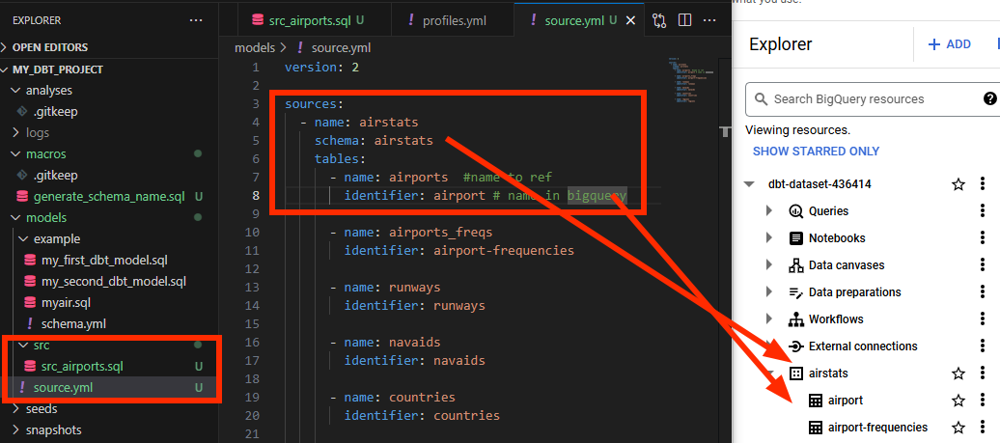
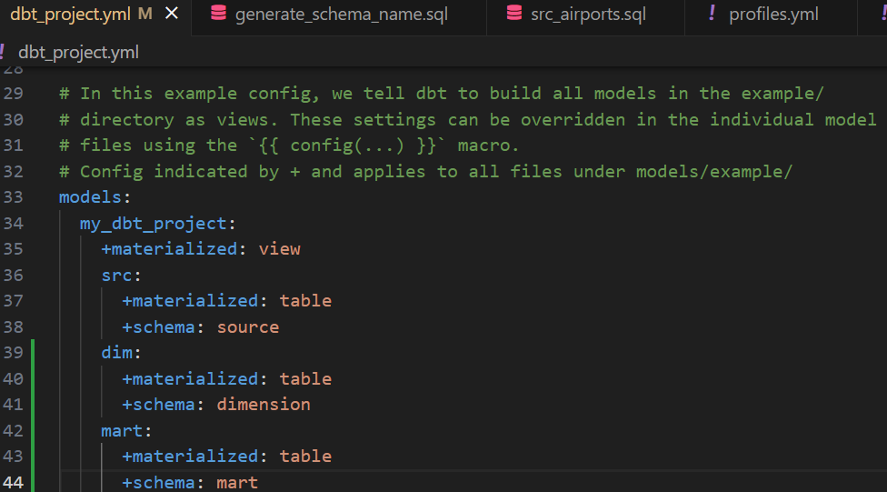

## DBT project
DBT will be used to do some data transformation and create our final analytics layer. The framework used to manage SQL table composition is DBT and we use GCP (Google Cloud Platform) BigQuery as our Data Warehouse.

Raw data:https://ourairports.com/data/  
         The csv files will be uploaded into BigQuery.

## Getting started:
### Step 1: Download Anaconda and create a New Python Environment in Anaconda.

In Anaconda Prompt:

```
conda create --name dbt-env python=3.9
conda activate dbt-env
```

### Step 2: Set up BigQuery and load data

### Step 3: Generate BigQuery key and configure BigQuery Profile
```
my_dbt_bigquery:
  outputs:
    dev:
      type: bigquery
      method: service-account
      project: dbt-dataset-436414  
      dataset: airstats        
      location: EU                
      keyfile: C:\Users\LiHu\dbt-dataset-436414-4a9165bb2533.json
  target: dev
```

### Step 4: Modelling
#### Create layers: src, dim, and mart
Under models folder create sources.yml which sets up the source of the data and will be easier to refer to later using jinja template.



#### Customize Schema Names
Add a sql file in macro:
```

    
    
        {{ default_schema }}
    
        {{ custom_schema_name | trim }}
    

```
#### Create schemas in BigQuery: source, dimension, mart and modify dbt_project.yml


### Run the project:
Run All Models
```
dbt run
```
Run a Specific Model with the model name:
```
dbt run -m src_airports
```
Test Models Validate models using built-in or custom tests:
```
dbt test
```

### Resources:
- Learn more about dbt [in the docs](https://docs.getdbt.com/docs/introduction)
- Check out [Discourse](https://discourse.getdbt.com/) for commonly asked questions and answers
- Join the [chat](https://community.getdbt.com/) on Slack for live discussions and support
- Find [dbt events](https://events.getdbt.com) near you
- Check out [the blog](https://blog.getdbt.com/) for the latest news on dbt's development and best practices
